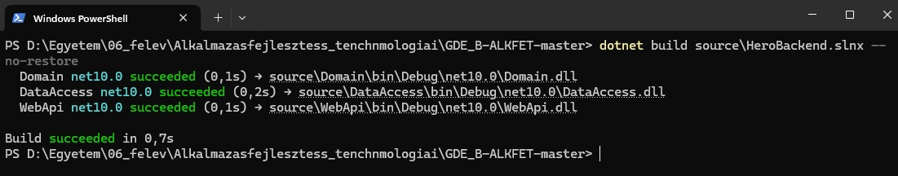
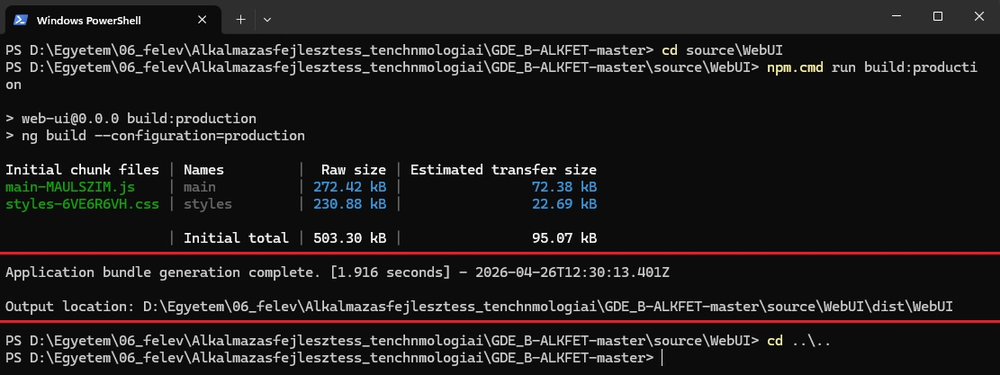
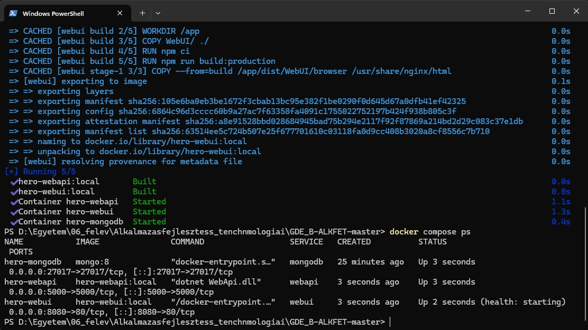
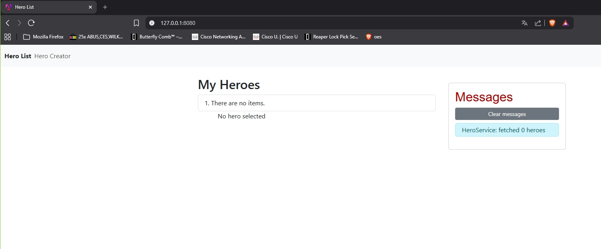
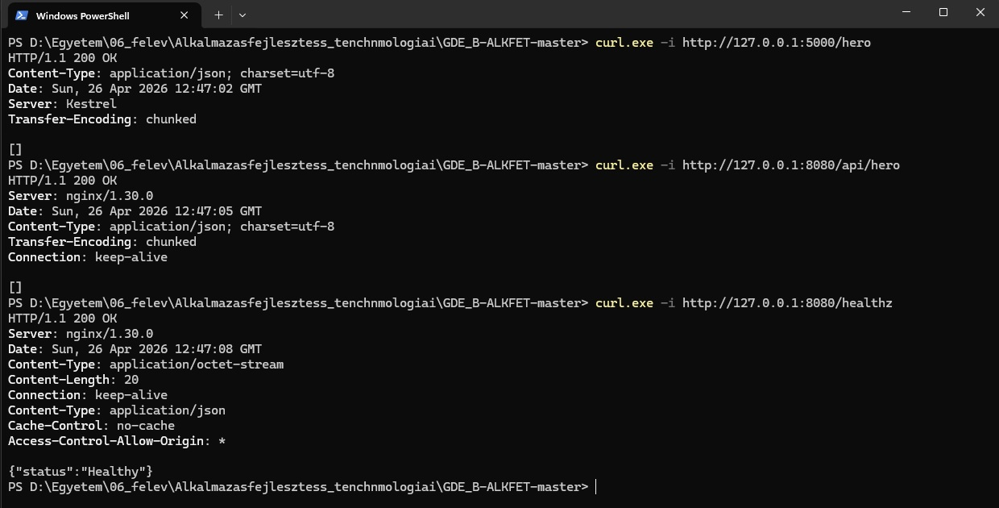
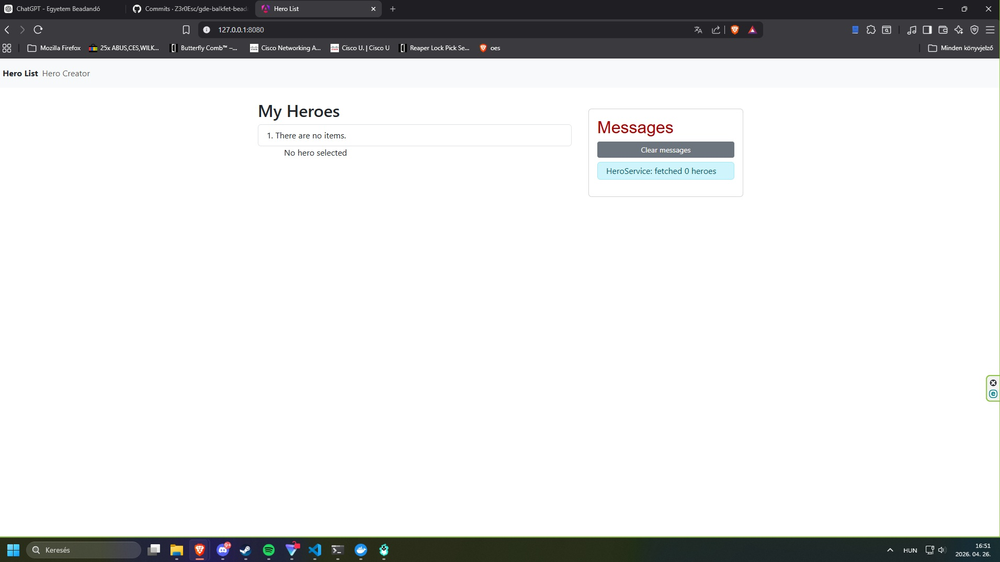
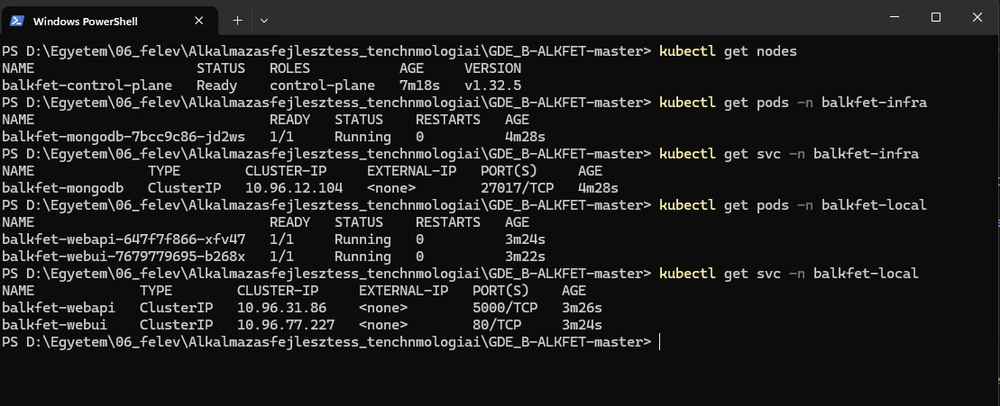

# Hero Manager

## 1. Projekt Rovid Leirasa

A projekt egy kontenerizalt Hero Manager webalkalmazas, amely Angular frontendbol, ASP.NET backendbol es MongoDB adatbazisbol all. Az alkalmazas egyszeru CRUD funkcionalitast biztosit hosok kezelesere. A frontend es backend Docker kontenerekbe kerult, lokalisan Docker Compose segitsegevel futtathato.

## 2. Technologiak

- Angular / TypeScript
- ASP.NET / C#
- MongoDB 8
- Docker
- Docker Compose
- GitHub Actions
- GitHub Container Registry
- Kubernetes
- Helm
- kind

## 3. Funkciok

- Hosok listazasa
- Hos letrehozasa
- Hos reszleteinek megtekintese
- Hos modositasa
- Hos torlese
- Frontend-backend kommunikacio REST API-n keresztul

## 4. Lokalis Docker Compose Futtatas

```powershell
docker compose up --build -d
docker compose ps
```

Elerhetosegek:

- Frontend: `http://127.0.0.1:8080`
- Backend API: `http://127.0.0.1:5000/hero`
- Proxyzott API: `http://127.0.0.1:8080/api/hero`

## 5. CI/CD

A GitHub Actions workflow-k main branchre torteno push eseten automatikusan buildelik a frontend es backend Docker image-eket, majd feltoltik oket a GitHub Container Registry-be.

Workflow-k:

- `.github/workflows/ci-docker-build-api.yml`
- `.github/workflows/ci-docker-build-ui.yml`

Image-ek:

```text
ghcr.io/z3r0esc/gde-balkfet-beadando/webapi:latest
ghcr.io/z3r0esc/gde-balkfet-beadando/webui:latest
```

## 6. Kubernetes Telepites

A Kubernetes manifestek a GHCR-be feltoltott image-eket hasznaljak. A MongoDB Helm charttal telepitheto. A helyi Kubernetes teszteles kind clusterrel tortent.

Kind cluster letrehozasa:

```powershell
kind create cluster --config kind-balkfet.yaml --image kindest/node:v1.32.5
```

MongoDB telepitese Helm-mel:

```powershell
helm repo add bitnami https://charts.bitnami.com/bitnami
helm repo update
kubectl create namespace balkfet-infra
helm upgrade --install balkfet-mongodb bitnami/mongodb --namespace balkfet-infra --set auth.enabled=false
```

Alkalmazas telepitese:

```powershell
kubectl apply -f deployment/local/namespace.yaml
kubectl apply -f deployment/local/secrets.yaml
kubectl apply -f deployment/local/webapi.yaml
kubectl apply -f deployment/local/webui.yaml
```

Ellenorzes:

```powershell
kubectl get pods -n balkfet-infra
kubectl get pods -n balkfet-local
kubectl get svc -n balkfet-local
```

Frontend elerese port-forwarddal:

```powershell
kubectl port-forward svc/balkfet-webui 8080:80 -n balkfet-local
```

## 7. Ellenorzes

Masik PowerShell ablakbol:

```powershell
curl.exe -i http://127.0.0.1:8080/
curl.exe -i http://127.0.0.1:8080/api/hero
```

Elvart proxyzott API valasz ures adatbazis eseten:

```text
HTTP/1.1 200 OK
[]
```

## 8. Bizonyitekok / Screenshot Javaslatok

Backend build sikeres kimenet:



Angular production build sikeres kimenet:



Docker Compose futas es kontener statusz:



Frontend bongeszoben:



Backend API, proxyzott API es healthcheck valasz:



Kubernetes cluster es eroforrasok:



Kubernetes podok Running allapotban:




## 9. Megjegyzes

A GHCR package-ek public/all visibility alatt vannak, ezert a helyi kind Kubernetes klaszterben `imagePullSecret` nelkul lehuzhatok. Privat package eseten `imagePullSecret` konfiguracio szukseges.

Reszletesebb dokumentacio:

- `REQSPEC.md`
- `USER_GUIDE.md`
- `deployment/deployment_guide.md`
