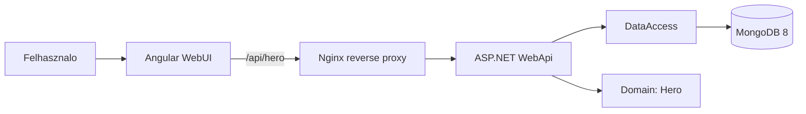
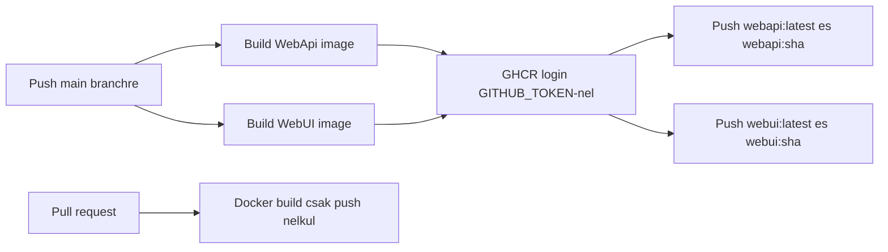

# Hero Manager

Hero Manager egy egyszeru full-stack beadando alkalmazas. Az Angular frontend hosok listazasat, letrehozasat, szerkeszteset es torleset biztosito feluletet ad, az ASP.NET backend REST API-t szolgaltat, az adatok MongoDB 8-ban tarolodnak.

## Funkciok

- Hosok listazasa
- Uj hos letrehozasa
- Meglevo hos nevenek modositasa
- Hos torlese
- Backend API hivasa Angular frontendbol
- Lokalis futtatas Docker Compose-zal
- Docker image build frontendhez es backendhez
- GHCR image push GitHub Actions workflow-bol
- Kubernetes telepites local es prod manifestekkel

## Technologiak

- Frontend: Angular, TypeScript, Bootstrap, Nginx
- Backend: ASP.NET minimal API, C#
- Domain: `Hero`
- Adatbazis: MongoDB 8
- Kontenerizacio: Docker, Docker Compose
- CI/CD: GitHub Actions, GitHub Container Registry
- Deployment: Kubernetes, Helm MongoDB chart

## Projekt Szerkezet

```text
source/
  Domain/       Domain modell
  DataAccess/   MongoDB kapcsolat
  WebApi/       ASP.NET REST API
  WebUI/        Angular frontend
deployment/
  local/        Lokalis Kubernetes manifestek
  prod/         Production Kubernetes manifestek
.github/
  workflows/   Docker image build es GHCR push workflow-k
```

## Architektura



## Lokalis .NET Build

```powershell
dotnet restore source\WebApi\WebApi.csproj
dotnet build source\HeroBackend.slnx --no-restore
```

Backend inditas lokalis MongoDB mellett:

```powershell
dotnet run --project source\WebApi\WebApi.csproj
```

## Frontend Build Windows Alatt

PowerShell alatt az `npm.ps1` execution policy miatt tiltott lehet. Windows eseten hasznald az `npm.cmd` valtozatot:

```powershell
cd source\WebUI
npm.cmd ci
npm.cmd run build:production
```

Alternativa:

```powershell
Set-ExecutionPolicy -Scope CurrentUser RemoteSigned
```

Fejlesztesi frontend API URL: `source/WebUI/src/environments/environment.development.ts`, alapbol `http://localhost:5000`.

## Docker Compose Futtatas

```powershell
docker compose down -v
docker compose up --build
```

Elert szolgaltatasok:

- Frontend: `http://localhost:8080`
- Backend API kozvetlenul: `http://localhost:5000/hero`
- MongoDB 8: `mongodb://localhost:27017`

Compose konfiguracio:

- `MongoDb__ConnectionString=mongodb://mongodb:27017`
- `MongoDb__Database=BALKFET`
- A `webapi` service `balkfet-webapi` network aliast kap, ezert az Nginx ugyanazzal a proxy celcimmel mukodik Docker Compose es Kubernetes alatt.

## API Rovid Leiras

Alap endpoint: `/hero`

| Muvelet | URL | Leiras |
| --- | --- | --- |
| GET | `/hero` | Osszes hos lekerese |
| GET | `/hero/{id}` | Egy hos lekerese GUID alapjan |
| POST | `/hero` | Uj hos letrehozasa |
| PUT | `/hero/{id}` | Meglevo hos modositasa |
| DELETE | `/hero/{id}` | Hos torlese |

Pelda requestek: `source/WebApi/WebApi.http`.

## Konfiguracio

Backend kornyezeti valtozok:

- `MongoDb__ConnectionString`: MongoDB connection string, pelda `mongodb://localhost:27017`
- `MongoDb__Database`: adatbazis neve, alapertelmezett `BALKFET`

Frontend production build:

- Az Angular app relativ `/api` URL-t hasznal.
- Az Nginx kontener a `/api/` utvonalat a `balkfet-webapi:5000` backend service-re proxyzza.

## CI/CD



A workflow-k:

- `.github/workflows/ci-docker-build-api.yml`
- `.github/workflows/ci-docker-build-ui.yml`

CI altal keszitett image nevek:

- `ghcr.io/${{ github.repository }}/webapi:latest`
- `ghcr.io/${{ github.repository }}/webapi:${{ github.sha }}`
- `ghcr.io/${{ github.repository }}/webui:latest`
- `ghcr.io/${{ github.repository }}/webui:${{ github.sha }}`

A Kubernetes manifestekben a placeholder image neveket csereld a sajat GHCR image neveidre:

- `ghcr.io/<github-user>/<repo>/webapi:latest`
- `ghcr.io/<github-user>/<repo>/webui:latest`

Ha a GHCR package privat, Kubernetesben `imagePullSecret` kell. Beadandohoz egyszerubb a GHCR package-eket publicra allitani.

## Kubernetes

Manifestek:

- `deployment/local`
- `deployment/prod`

Mindketto tartalmaz namespace-et, Secretet, backend Deployment/Service-t es frontend Deployment/Service-t. A MongoDB 8 telepitese Helm charttal dokumentalt a `deployment/deployment_guide.md` fajlban.

## Hasznalati Utmutato

Reszletes hasznalati utmutato: `USER_GUIDE.md`.

## Deployment Utmutato

Kubernetes telepitesi lepesek: `deployment/deployment_guide.md`.
