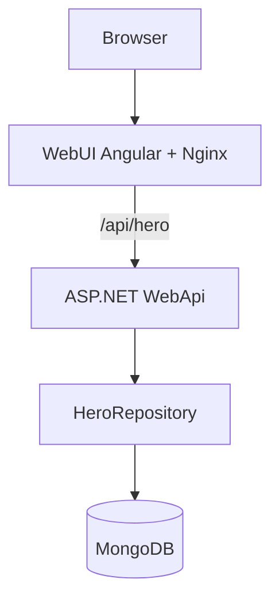
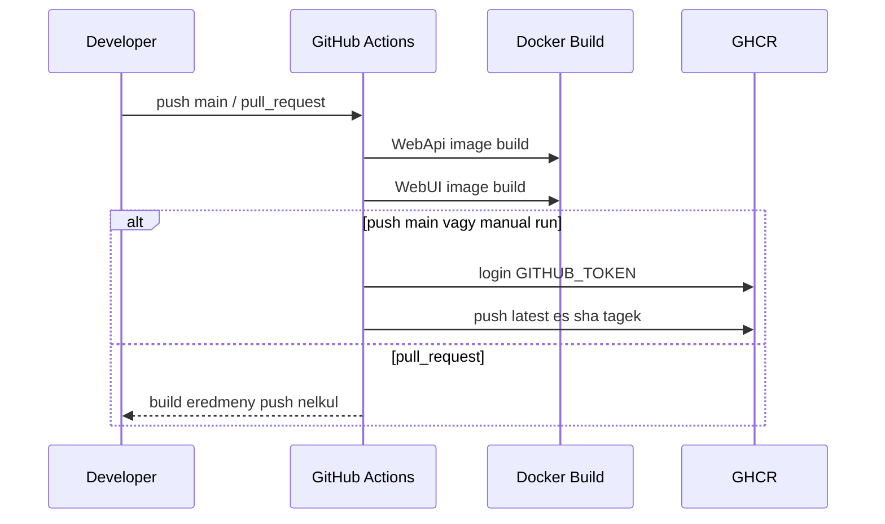

# Kovetelmenyspecifikacio

## Cel

Egy beadando-kompatibilis full-stack alkalmazas keszitese, amely Angular frontendbol, ASP.NET backendbol, MongoDB adatbazisbol, Docker kontenerekbol, GitHub Actions CI/CD workflow-bol, GHCR image pushbol, Kubernetes manifestekbol es dokumentaciobol all.

## Valasztott Domain Modell

Az alkalmazas domainje egy egyszeru hosnyilvantarto.

```csharp
public record Hero
{
    public required Guid Id { get; init; }
    public required string Name { get; init; }
}
```

## Komponensek

| Komponens | Technologia | Felelosseg |
| --- | --- | --- |
| WebUI | Angular / TypeScript | Felhasznaloi felulet, API hivasok |
| WebApi | ASP.NET / C# | REST API, validacio, repository hasznalat |
| Domain | C# class library | Domain modell |
| DataAccess | C# class library, MongoDB.Driver | MongoDB kapcsolat |
| MongoDB | MongoDB 8 | Hos adatok tarolasa |
| Docker | Dockerfile, Compose | Kontenerizalt futtatas |
| CI/CD | GitHub Actions | Image build es GHCR push |
| Kubernetes | YAML manifestek | Deployment es service definiciok |

## Architektura



## Funkcionalis Kovetelmenyek

| ID | Kovetelmeny | Megvalositas |
| --- | --- | --- |
| F1 | Hosok listazasa | `GET /hero`, Angular listaoldal |
| F2 | Egy hos lekerese | `GET /hero/{id}` |
| F3 | Hos letrehozasa | `POST /hero`, Angular creator oldal |
| F4 | Hos modositasa | `PUT /hero/{id}`, detail/szerkeszto komponens |
| F5 | Hos torlese | `DELETE /hero/{id}`, detail/szerkeszto komponens |
| F6 | Frontend-backend kapcsolat | Angular `HeroService` HTTP kliens |
| F7 | Adatperzisztencia | MongoDB `Heroes` collection |

## Nem Funkcionalis Kovetelmenyek

| ID | Kovetelmeny | Megvalositas |
| --- | --- | --- |
| NF1 | Kontenerizalhatosag | Kulon Dockerfile frontendhez es backendhez |
| NF2 | Konfiguralhatosag | `MongoDb__ConnectionString`, `MongoDb__Database` |
| NF3 | Lokalis indithatosag | `docker-compose.yml` |
| NF4 | CI/CD | GitHub Actions GHCR push |
| NF5 | Kubernetes kompatibilitas | `deployment/local`, `deployment/prod` manifestek |
| NF6 | Dokumentaltsag | README, REQSPEC, deployment guide, user guide |

## Beadando Megfeleles

| Beadando kovetelmeny | Allapot |
| --- | --- |
| Egyszeru domain modell | Teljesitve: `Hero` |
| Frontend komponens | Teljesitve: Angular WebUI |
| Backend komponens | Teljesitve: ASP.NET WebApi |
| Frontend es backend osszekotve | Teljesitve: Angular `HeroService` + `/api` proxy |
| Kontenerizalt komponensek | Teljesitve: WebApi es WebUI Dockerfile |
| MongoDB adatbazis | Teljesitve: MongoDB.Driver + connection factory |
| CI workflow image builddel | Teljesitve: `.github/workflows` |
| GHCR image push | Teljesitve: main push es workflow_dispatch eseten |
| Pull request build push nelkul | Teljesitve |
| Kubernetes manifestek | Teljesitve: namespace, Secret, Deployment, Service |
| User guide | Teljesitve: `USER_GUIDE.md` |
| Deployment dokumentacio | Teljesitve: `deployment/deployment_guide.md` |

## CI/CD Pipeline


