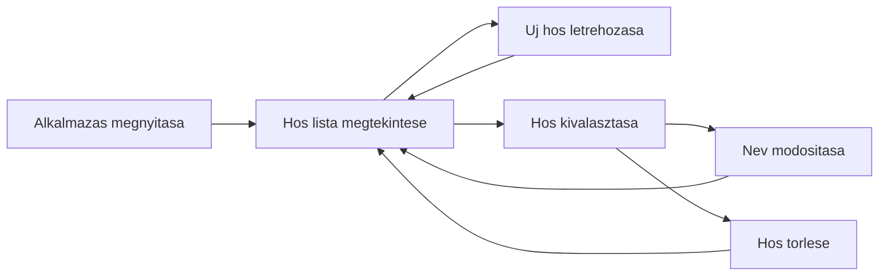

# User Guide

## Alkalmazas Celja

A Hero Manager egy egyszeru hosnyilvantarto alkalmazas. A felhasznalo hosoket tud listazni, letrehozni, modositani es torolni.

## Inditas

Docker Compose-zal:

```powershell
docker compose down -v
docker compose up --build
```

Nyisd meg:

```text
http://localhost:8080
```

Kubernetes port-forward eseten:

```powershell
kubectl port-forward svc/balkfet-webui 8080:80 -n balkfet-local
```

## Listaoldal

A nyito oldal a hosok listaja. Minden elemnel latszik:

- a hos azonositoja,
- a hos neve.

Egy listaelemre kattintva megnyilik a szerkeszto/reszletezo panel.

## Letrehozas

1. Kattints a `Hero Creator` menure.
2. Ird be az uj hos nevet.
3. Kattints a `Create` gombra.
4. Az alkalmazas letrehozza az uj host egy automatikusan generalt GUID azonosítóval.

## Modositas

1. A `Hero List` oldalon valassz ki egy host.
2. A megjeleno reszletezo panelen modositsd a nevet.
3. Kattints a mentes gombra.
4. A backend `PUT /hero/{id}` hivassal menti a valtozast.

## Torles

1. A `Hero List` oldalon valassz ki egy host.
2. A reszletezo panelen kattints a torles gombra.
3. A backend `DELETE /hero/{id}` hivassal torli az elemet.
4. A lista frissul, a torolt elem eltunik.

## Tipikus Felhasznaloi Folyamat



## Funkciok Rovid Osszefoglalasa

| Funkcio | Hol erheto el |
| --- | --- |
| Lista | `Hero List` |
| Letrehozas | `Hero Creator` |
| Modositas | Listaelembol nyilo reszletezo panel |
| Torles | Listaelembol nyilo reszletezo panel |
| Uzenetek | Jobb oldali uzenet panel |
