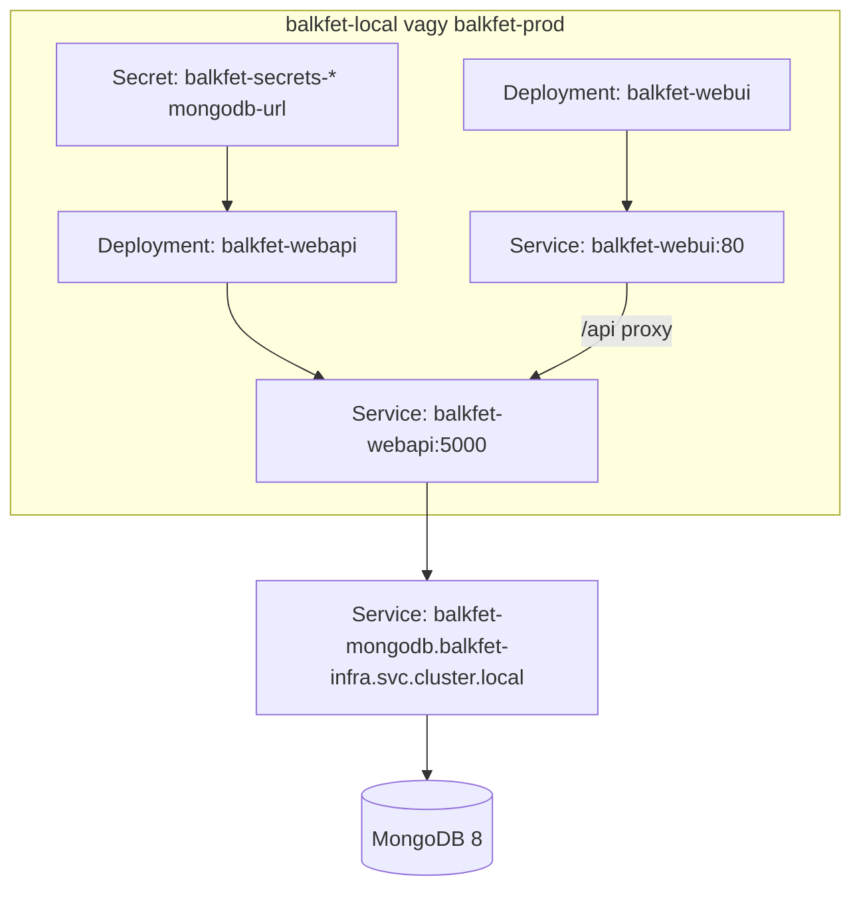

# Deployment Guide

## Elofeltetelek

- Docker Desktop vagy kompatibilis Docker engine
- `kubectl`
- Helm
- Helyi Kubernetes klaszter, peldaul Docker Desktop Kubernetes, minikube vagy kind
- GHCR-ben elerheto public image-ek:
  - `ghcr.io/z3r0esc/gde-balkfet-beadando/webapi:latest`
  - `ghcr.io/z3r0esc/gde-balkfet-beadando/webui:latest`

A manifestek mar a public GHCR image-eket hasznaljak:

```text
ghcr.io/z3r0esc/gde-balkfet-beadando/webapi:latest
ghcr.io/z3r0esc/gde-balkfet-beadando/webui:latest
```

A GHCR package-ek public lathatosaguak, ezert Kubernetesben nem kell `imagePullSecret`. Privat GHCR package eseten viszont `imagePullSecret` kellene.

## MongoDB 8 Telepitese Helmmel

A backend a `MongoDb__ConnectionString` kornyezeti valtozot olvassa. A manifestekben ez a `balkfet-secrets-*` Secret `mongodb-url` kulcsabol jon.

Telepites Bitnami charttal:

```powershell
kubectl create namespace balkfet-infra
helm repo add bitnami https://charts.bitnami.com/bitnami
helm repo update
helm upgrade --install balkfet-mongodb bitnami/mongodb --namespace balkfet-infra --set auth.enabled=false --set image.tag=8
```

A manifestek jelenlegi MongoDB URL-je:

```text
mongodb://balkfet-mongodb.balkfet-infra.svc.cluster.local:27017
```

Ellenorizd a tenyleges service nevet:

```powershell
kubectl get svc -n balkfet-infra
```

Ha a chart mas service nevet hoz letre, modositsd a `deployment/local/secrets.yaml` es `deployment/prod/secrets.yaml` `mongodb-url` erteket.

## Lokalis Kubernetes Telepites

```powershell
kubectl apply -f deployment/local/namespace.yaml
kubectl apply -f deployment/local/secrets.yaml
kubectl apply -f deployment/local/webapi.yaml
kubectl apply -f deployment/local/webui.yaml
```

Ellenorzes:

```powershell
kubectl get pods -n balkfet-local
kubectl get svc -n balkfet-local
kubectl logs deployment/balkfet-webapi -n balkfet-local
```

Frontend elerese:

```powershell
kubectl port-forward svc/balkfet-webui 8080:80 -n balkfet-local
```

Nyisd meg: `http://localhost:8080`

Backend API kozvetlen port-forwarddal:

```powershell
kubectl port-forward svc/balkfet-webapi 5000:5000 -n balkfet-local
```

Teszt: `http://localhost:5000/hero`

## Production Manifestek

```powershell
kubectl apply -f deployment/prod/namespace.yaml
kubectl apply -f deployment/prod/secrets.yaml
kubectl apply -f deployment/prod/webapi.yaml
kubectl apply -f deployment/prod/webui.yaml
```

Production frontend port-forward:

```powershell
kubectl port-forward svc/balkfet-webui 8080:80 -n balkfet-prod
```

## Kubernetes Attekintes



## Docker Compose Alternativa

Kubernetes nelkuli lokalis ellenorzeshez:

```powershell
docker compose down -v
docker compose up --build
```

Elert URL-ek:

- Frontend: `http://localhost:8080`
- Backend API: `http://localhost:5000/hero`
- MongoDB 8: `mongodb://localhost:27017`

A frontend production build relativ `/api` utvonalat hasznal. Docker Compose alatt az Nginx ezt a `balkfet-webapi:5000` cimre proxyzza. A `webapi` service ehhez `balkfet-webapi` network aliast kap.

## Windows npm Parancsok

PowerShell alatt az `npm.ps1` tiltott lehet:

```text
npm.ps1 cannot be loaded because running scripts is disabled on this system
```

Hasznald az `npm.cmd` valtozatot:

```powershell
cd source\WebUI
npm.cmd ci
npm.cmd run build:production
```

Alternativa:

```powershell
Set-ExecutionPolicy -Scope CurrentUser RemoteSigned
```

## Hibaelharitas

Pod statusz:

```powershell
kubectl describe pod -l app=balkfet-webapi -n balkfet-local
kubectl describe pod -l app=balkfet-webui -n balkfet-local
```

Logok:

```powershell
kubectl logs deployment/balkfet-webapi -n balkfet-local
kubectl logs deployment/balkfet-webui -n balkfet-local
```

Tipikus problemak:

- `ImagePullBackOff`: az image nev nincs atirva sajat GHCR image-re, vagy a package privat. Public GHCR package javasolt.
- MongoDB connection hiba: futtasd `kubectl get svc -n balkfet-infra`, majd ellenorizd a `deployment/*/secrets.yaml` `mongodb-url` erteket.
- Frontend API hiba Kubernetesben: ellenorizd, hogy a `balkfet-webapi` service ugyanabban a namespace-ben letezik, ahol a frontend fut.
- Docker Compose `host not found in upstream "balkfet-webapi"`: ellenorizd, hogy a `docker-compose.yml` `webapi` service alatt szerepel-e a `balkfet-webapi` network alias.
- PowerShell `npm.ps1` tiltott: hasznald az `npm.cmd` parancsot.
